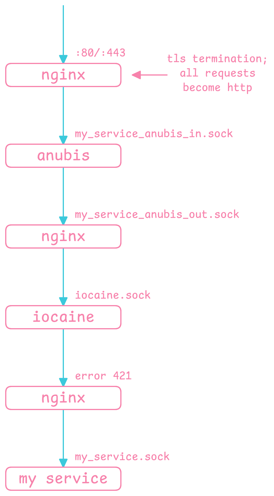

# main server

config/infra for services on main server :3

this is meant to be a semi-reusable docker compose project built out of somewhat-more-reusable docker compose subprojects. most changes you need to make to reuse these modules should be in `.env` files (e.g. relative paths, uids/gids, and the like); i tried my best to modularize them but the proxy, by design, still has to couple with the services somehow (and docker compose seems a bit limited, e.g. not being able to control what `.env` files to use for yaml interpolation from within the compose file itself). deployment should be handled via the scripts provided.

and, to docker compose: you really are a cool concept, but sincerely, from the deepest depths of my heart, fuck you.

## infra overview
- traffic for a service usually takes the following path, with nginx being a reverse proxy:

    

- anubis should have one separate instance per service in order to write service-specific filtering rules, whereas iocaine is a single server-wide instance for simplicity. the `./proxy/anubis/` subproject is the BASE anubis setup that each service's anubis instance should build off of.

## first time setup guide

- make sure docker is installed and enabled as a systemd service.
- write a `.env` file at every place that has a `.env.example` that is correct for your setup, and make sure all the "SYNC" comments in every file in the project are checked.
- make sure bind mounts have the right perms on the host for the containers to access them.
- for ssl web services, you may need to tweak the nginx config to accept http first, then run certbot on the host (i do not have a dockerized certbot since it's probably complicated and might have chicken-and-egg issues with nginx) to general ssl certs.
- run `deploy.sh` or `deploy_all.sh` in the appropriate project directory to start or restart the containers. the `deploy.sh`s found in some subproject should allow you to deploy or restart that subproject independently. in production, you probably want to use a systemd service to run these scripts.

## developer/maintenance guide

- if something isn't working, common places to check are:
    - perms perms perms (e.g. for unix sockets or bind mounts). it's always perms.
    - `.env`s especially the relative paths
    - the "SYNC" comments
    - perms
- avoid these since they will probably break, both the project and your heart:
    - attemping to use a non-default or more than one `.env` file in a subproject for compose.yaml interpolation: recursive includes of these files will often break the relative paths to these `.env` files in ways that i do not comprehend, not to mention that you will also have to keep track of which `.env` files to use in deploy scripts/when running manual docker commands. this is why i have a script that manually copies values between `.env` files that are run by the relevant deploy scripts, and also why docker compose turned my hair gray.
- general docker stuffs:
    - use named volumes for container-generated data that needs to be persisted across service restarts, and use bind mounts for either host-provided data or container-provided data that the host also needs to control/know the path to.
- currently, only `deploy.sh` for items that need to be frequently restarted by themselves are provided.

---

i think if docker and nix had a baby then i would be very happy.
